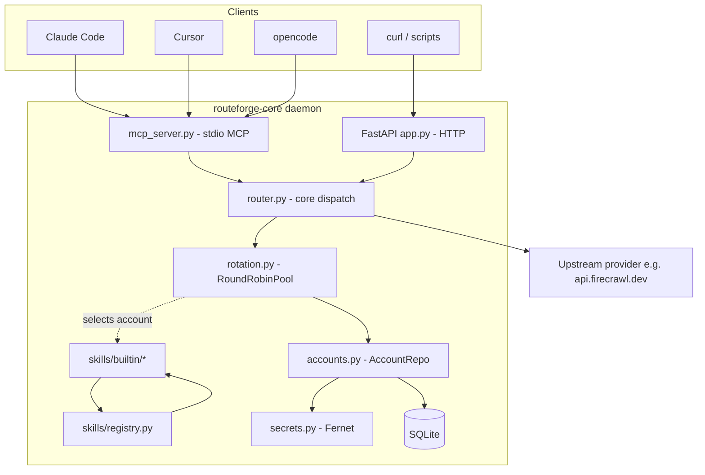

# Design — bootstrap-core

## Goal

Establish routeforge-core as a working multi-account AI API gateway: HTTP + stdio MCP entry points, encrypted account store, round-robin rotation with cooldown, a pluggable skills registry, and two builtin skills (echo + firecrawl/scrape) so the system can be exercised end-to-end.

## High-level architecture

## Component breakdown

### `src/routeforge/`

- `config.py`: loads `~/.routeforge/routeforge.db` path from `ROUTE_FORGE_DB` (default) and master key from `ROUTE_FORGE_MASTER_KEY`. Provides typed `Settings` via Pydantic.
- `secrets.py`: `Secrets` wraps a `cryptography.fernet.Fernet` instance. `encrypt(plaintext: str) -> bytes`, `decrypt(ciphertext: bytes) -> str`. Validates the master key at startup; if missing, refuses to start with a clear error.
- `db.py`: opens the SQLite connection (WAL mode), applies the schema (`accounts`, `usage_log`), exposes a `transaction()` context manager. Schema migrations are inline `CREATE TABLE IF NOT EXISTS` statements; Alembic is overkill for v1.
- `accounts.py`: `Account` dataclass + `AccountRepo`. CRUD methods plus `list_by_provider(provider) -> list[Account]`.
- `rotation.py`: `RoundRobinPool` per provider. Holds a list of accounts, a cursor, and a `CooldownTracker`. `async def acquire(provider) -> Account | None` returns the next non-cooled-down account or `None` if all are cooling. `mark_failure(account, reason)` and `mark_success(account)` update the cooldown state.
- `router.py`: `Router` ties everything. `async def call_skill(skill_name, args) -> dict` does: registry lookup, account acquire, skill.execute, mark success/failure, log to usage_log.
- `skills/base.py`: `Skill` ABC with `name`, `provider`, `schema()` returning a `SkillSchema`, and `async execute(account, args, http) -> dict`. `SkillSchema.inputs` and `outputs` are JSON-Schema-style dicts.
- `skills/registry.py`: `SkillRegistry` discovers skills from `routeforge.skills.builtin` (entry_points in v2). `get(name) -> Skill | None`.
- `skills/builtin/echo.py`: returns the args unchanged. Used for smoke tests.
- `skills/builtin/firecrawl.py`: `firecrawl/scrape` — POSTs `{url, formats}` to `{base_url}/v1/scrape` with the account's bearer token, returns `{markdown, metadata}`.
- `app.py`: FastAPI factory. Endpoints:
  - `GET /v1/skills` — list registered skills.
  - `POST /v1/chat/completions` — OpenAI-compatible. Body has `model: "skill:<name>"` plus messages. The core translates the messages into the skill's args.
  - `POST /skills/{name}/call` — direct typed call. Body is `{args: {...}}`.
  - `GET /v1/accounts` — list accounts grouped by provider.
  - `GET /v1/usage?provider=...` — usage summary.
- `mcp_server.py`: builds an MCP server via the `mcp` Python SDK. Tools:
  - `list_skills()` — returns `[{name, provider, description, schema}, ...]`.
  - `call_skill(name: str, args: dict)` — calls `router.call_skill`.
  - `list_accounts(provider: str | None)` — returns account metadata (no secrets).
  - `get_usage(provider: str | None)` — returns aggregated usage stats.
- `cli/main.py`: Typer app. Subcommands: `accounts add|list|rotate`, `serve`, `mcp`.

### Tests under `tests/`

- `test_rotation.py`: round-robin cursor advances; cooldown excludes accounts; pool returns None when all cooled.
- `test_router.py`: skill dispatch + cooldown on simulated 429.
- `test_secrets.py`: round-trip encrypt/decrypt, missing master key raises.
- `test_skills.py`: echo skill returns args; firecrawl skill builds correct request (mocked httpx).

### `examples/config.yaml`

A reference YAML for documentation only. The runtime does NOT read this file in v1 — accounts are added via the CLI which writes encrypted rows to SQLite. The example exists to teach the user what the CLI does.

## Decisions

### D1: SQLite + Fernet instead of Vault or env vars

Rationale: the user wants personal use, multi-account per provider, and an admin CLI. Vault adds operational overhead; env vars can't model N accounts cleanly. SQLite + Fernet gives us a single encrypted file on disk that the CLI can manage, and the daemon reads at startup.

### D2: MCP server is stdio only in v1

Rationale: stdio MCP is the simplest transport and is what Claude Code, Cursor, opencode, and most editors support out of the box. HTTP/SSE MCP requires a separate transport and authentication decisions that are out of scope.

### D3: Skill execution is async-only

Rationale: skills call upstream APIs which are I/O bound. Async + httpx keeps the rotation pool concurrent without thread overhead.

### D4: OpenAI-compatible endpoint supports only the `skill:` prefix in v1

Rationale: routing arbitrary model names is a separate concern; v1 just exposes `skill:<name>` so a client can call any registered skill through the OpenAI chat-completions shim.

## Trade-offs

- **Single daemon, both HTTP and MCP**: cleaner than two processes. The HTTP and MCP surfaces share the same `Router` and account pool.
- **YAML is example-only, not runtime config**: avoids dual sources of truth (CLI vs file). The CLI is the only way to mutate accounts in v1.
- **No streaming**: limits use cases to short-lived calls. Acceptable because Firecrawl, Tavily, etc. all return reasonable-size JSON. Streaming can come in v2.
- **No auth on the HTTP daemon**: the daemon is local-only (default bind `127.0.0.1`). If exposed publicly, the user must add a reverse proxy with auth. Documented in README.

## Non-goals

- Token-bucket credit tracking per account.
- OAuth flows for upstream APIs.
- Multi-tenant virtual keys.
- Web admin UI.
- Streaming responses.
- HTTP/SSE MCP transport.
- Account rotation alerts (e.g. "all Firecrawl accounts cooled down").

## References

- `~/.agents/OPENSPEC.md` — OpenSpec workflow guide on this machine.
- `~/.config/opencode/scripts/Assert-OpenspecChange.ps1` — enforcement helper.